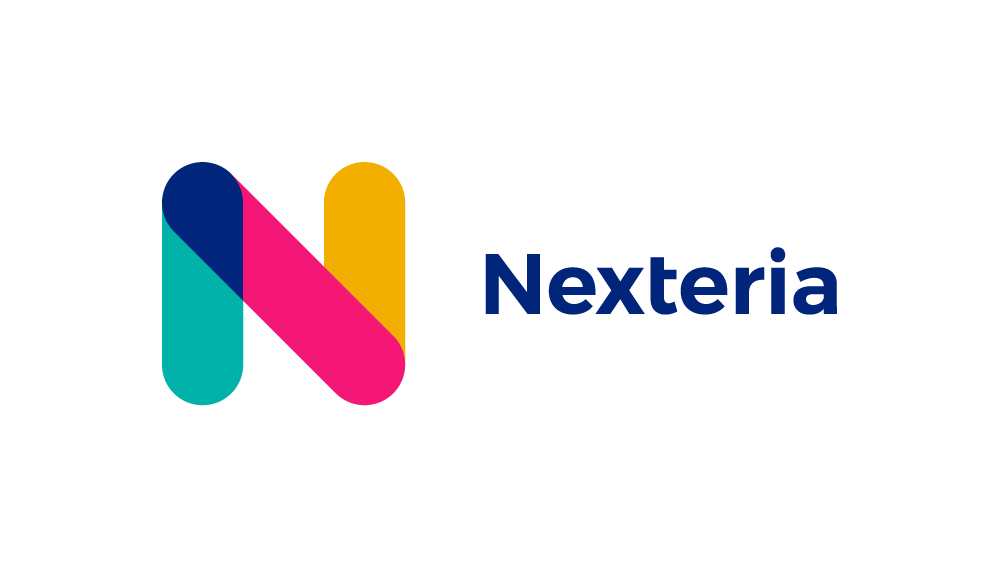

# Dokumentácia

TODO:

## Návod na použitie

TODO:

### Získanie prístupu do Google Forms API

TODO:

### Čo tento nástroj automizuje?

TODO:

### Čo tento nástroj NEautomizuje?

TODO:

## Je potrebná zmena šablóny?

TODO:

Šablóna musí byť vytvorená na základe dokumentácie nástroja [docxtemplater](https://docxtemplater.readthedocs.io/en/latest/index.html) aby tento nástroj vedel do dokumentu vložiť dáta, tj. spätnú väzbu. Demo je dostupné [tu](https://docxtemplater.com/demo/).

## Našiel/a som chybu!

TODO:
